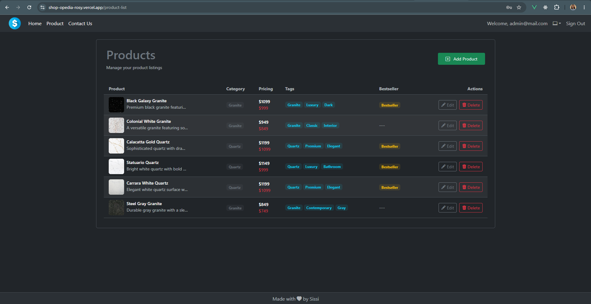
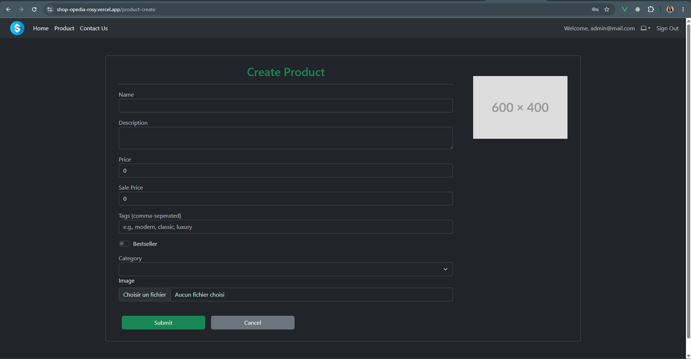

# 💎 ShopOpedia
> **Your One-Stop Stone Shop** — A premium catalog and administration system for Granite & Quartz stone products, built with Vue 3, Vite, Firebase, and Cloudinary.

---

## 📖 Project Overview

**ShopOpedia** is a modern web application designed to showcase a collection of premium granite and quartz stone products. It provides a fluid, responsive public storefront for customers to search, sort, and filter products by category, alongside a comprehensive, role-protected **Admin Dashboard** for managing inventory.

---

## 🔒 Access Control (Public vs. Private/Admin)

The application enforces a secure role-based access control system managed through **Firebase Authentication** and **Firestore** permissions:

*   **Public Access**: Anyone can view the home page, browse the product collection, filter/search products, and submit queries via the "Contact Us" page.
*   **Admin-Only Access**: Product management views—specifically viewing the product table, adding new products, editing existing products, and deleting listings—are **strictly restricted**. Users attempting to access these routes without an `ADMIN` role will be blocked by the Vue Router guards and redirected to an "Access Denied" or "Sign In" page.

---

## 🖼️ Private Admin Previews (Restricted Areas)

Since these administrative sections are not accessible to the public, here are visual previews of the backend interface:

### 1. Product Listings Dashboard (`/product-list`)
The primary administrative hub where administrators can view all products in a structured table, filterable by categories, containing price points, sales tags, bestseller flags, and quick links to edit or delete.



### 2. Product Creator & Editor (`/product-create` / `/product-update/:id`)
A fully-validated product composition interface allowing administrators to upload high-quality product images directly to **Cloudinary**, edit metadata, toggle promotional flags (e.g., bestseller), and update catalog pricing.



---

## ✨ Features

### 🛒 Public Storefront
*   **Interactive Search**: Instantly find products by typing their name.
*   **Dynamic Filtering**: Filter catalog items by product category (e.g., Granite, Quartz).
*   **Advanced Sorting**: Sort products alphabetically (A-Z, Z-A) or by pricing (low-to-high, high-to-low).
*   **Contact Form**: Clean and interactive form for customer inquiries.
*   **Theme Toggle**: Toggle between **Light** and **Dark** themes with state persistence.

### 🛡️ Admin Panel (Role-Restricted)
*   **Inventory Table**: Clean list displaying product thumbnails, categories, pricing structure, custom tags, and bestseller status.
*   **Cloudinary Upload Integration**: Upload images from the local computer directly to the cloud and retrieve optimized links.
*   **Inline Editing & Deletion**: Update inventory records and remove listings in real-time.
*   **Authentication & Registration**: Built-in sign-in and sign-up pages powered by Firebase Auth.

---

## 🛠️ Tech Stack

*   **Frontend Framework**: [Vue 3](https://vuejs.org/) (Composition API with `<script setup>`)
*   **Build Tool**: [Vite](https://vite.dev/)
*   **State Management**: [Pinia](https://pinia.vuejs.org/) with [pinia-plugin-persistedstate](https://github.com/prazdevs/pinia-plugin-persistedstate) for persistent storage of user sessions and themes.
*   **Routing**: [Vue Router 5](https://router.vuejs.org/) (Configured with role-based navigation guards).
*   **Database & Auth**: [Firebase](https://firebase.google.com/) (Auth for logins, Firestore for storing user roles and products).
*   **Cloud Asset Hosting**: [Cloudinary](https://cloudinary.com/) (Used for remote product image uploads).
*   **Styling**: [Bootstrap 5](https://getbootstrap.com/) & [Bootstrap Icons](https://icons.getbootstrap.com/).
*   **Alerts**: [SweetAlert2](https://sweetalert2.github.io/) for high-fidelity interactive alerts and confirmations.

---

## ⚙️ Getting Started

### Prerequisites
Make sure you have Node.js installed (version `>= 20.19.0` or `>= 22.12.0` is recommended).

### Installation
Clone the repository and install all dependencies:
```sh
npm install
```

### Run in Development Mode
Launch the local development server:
```sh
npm run dev
```
Open [http://localhost:5173](http://localhost:5173) in your browser to view the application.

### Build for Production
Compile and minify the project for production:
```sh
npm run build
```

### Formatting & Linting
Run linter checks and auto-format code:
```sh
# Lint with ESLint & Oxlint
npm run lint

# Format with Prettier
npm run format
```

---

## 💻 Recommended Development Setup

*   **IDE**: [VS Code](https://code.visualstudio.com/) + [Vue (Official) Extension](https://marketplace.visualstudio.com/items?itemName=Vue.volar) (Ensure Vetur is disabled).
*   **Browser Setup**:
    *   Install [Vue.js Devtools](https://chromewebstore.google.com/detail/vuejs-devtools/nhdogjmejiglipccpnnnanhbledajbpd).
    *   Enable **Custom Object Formatters** in your browser's Developer Tools settings for clean logging of Vue reactive references.
